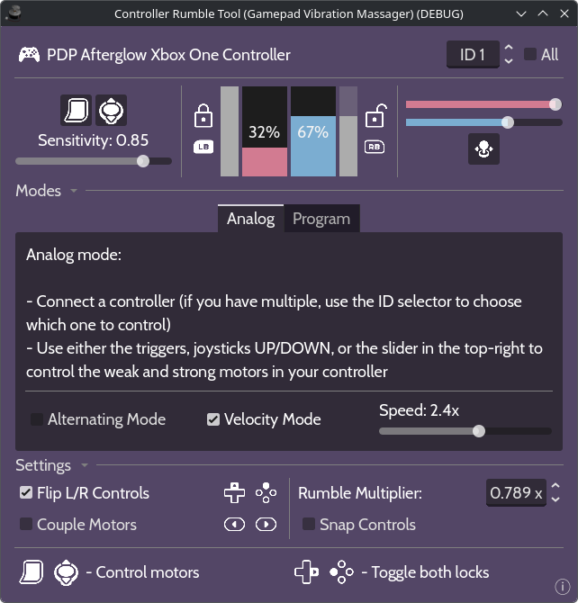

# Controller Rumble Tool
 (Gamepad Vibration Massager)
 
 A Godot app for directly controlling the rumble motors of a gamepad. Useful for controller diagnostics and massages!
 
 
 
 🚨 **Warning:** We are not responsible for any damage that may be caused to you or your controller. Be mindful of excessive vibrations and battery drain.

## Features
 - ⚡ Interact directly with the 2 motors, weak and strong, that are present in most modern controllers
 - 🕹️ Use either the triggers, joysticks or mouse for a variety of tactile input options
 - 🎮 Choose which device to control using its ID (or even all of them!)
 - 🔒 Lock any (or both) motors to keep them rumbling continuously
 - ↔️ Ambidextrous gamepad controls (a mouse is still needed for full program functionality)
 - 🔧 Snap, flip or join controls with various settings you can enable on the fly
 
 **Technical:**
 
 - 🔁 Continuity fix: Allows controllers to rumble indefinitely at the same intensity (overcoming possible rumble duration hardware limitations)
 - *️⃣ Rumble Multiplier: Apply a custom multiplier to reduce maximum intensity (can help with stubborn rumble cut-off issues on Linux)
 
## Download
 To get the latest version: https://github.com/leosefcik/controller-rumble-tool/releases/latest

## Links
 This GitHub: https://github.com/leosefcik/controller-rumble-tool
 
 Itch.io (WIP): https://leosefcik.itch.io/controller-rumble-tool
 
## Credits:
 - Cabin Font - https://github.com/impallari/Cabin
 - Glyphs - https://kenney.nl/assets/input-prompts
 - Icons - https://fonts.google.com/icons
 - Godot 4.5.1, Blender 5.0.1
 
 Made by leosefcik 2025-2026
 
 https://eggsandchickens.info
 
## Export template
 To achieve a smaller export size, I compiled an export template using the following command:
 
 Linux:
 `scons platform=linuxbsd arch=x86_64 production=yes target=template_release debug_symbols=no optimize=size_extra lto=full disable_3d=yes vulkan=no use_volk=no openxr=no disable_navigation_2d=yes disable_navigation_3d=yes disable_xr=yes module_text_server_adv_enabled=no module_text_server_fb_enabled=yes minizip=no`
 
 Windows:
 `scons platform=windows arch=x86_64 production=yes target=template_release debug_symbols=no optimize=size_extra lto=full disable_3d=yes vulkan=no use_volk=no openxr=no disable_navigation_2d=yes disable_navigation_3d=yes disable_xr=yes module_text_server_adv_enabled=no module_text_server_fb_enabled=yes minizip=no`
 
 This brought the binary size (for Linux at least) from 68.2MiB to 26.5MiB! That's fine enough.
 
 Resources used:
 - https://popcar.bearblog.dev/how-to-minify-godots-build-size/
 - https://docs.godotengine.org/en/4.4/contributing/development/compiling/optimizing_for_size.html
